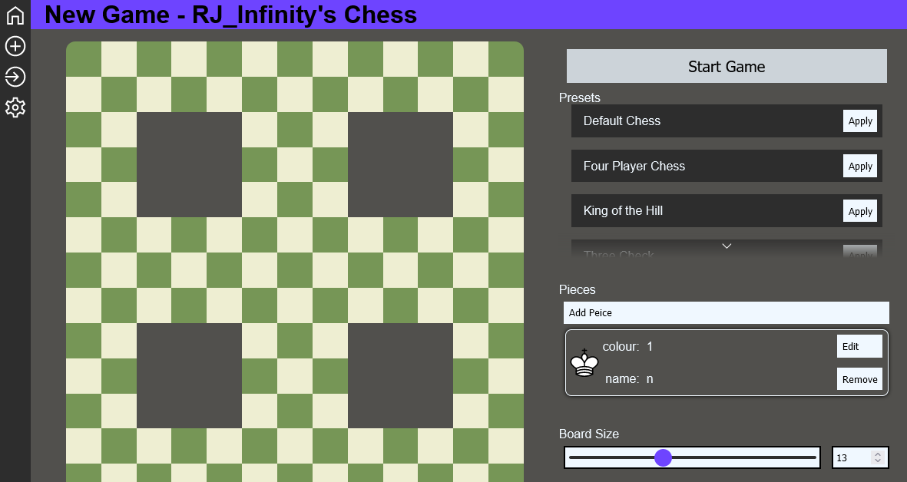

# Chess Engine

this is a online chess game that is eventualy supposed to be compleatly customisable

## how to run
it is mainly a website
the server can be run localy with python and flask

once flask is installed you can run
`$ python src/main.py`
this will run the server logging where it is hosted which can then be connected to from any modern web browser

the board can have custom positions sizes and valid squares alowed among more future customisations.


## What's in the repo

### The Website
This is the main part of the system and has a small backend in python ([see how to run](#how-to-run)) this serves web files built with pure html css and js.

### The board
This is another project that i have created and is hosted at [github.com/RJ-Infinity/CustomElements](https://github.com/RJ-Infinity/CustomElements/tree/main/src/ChessBoard).

### The movement code
this is curently a work in progress. The movement system is completly customisable with a cpd (chess piece definition file) which is a system for encoding where each piece can move and should be expandable to other board games with moving pieces and is hosted in [/web/static/cpd.js](https://github.com/RJ-Infinity/ChessEngine/blob/main/web/static/cpd.js) this is a full parser (and yet to be completed) enviroment for interfacing with the cpd file.


## Chess Piece Definition File
this is a custom file format that defines how a chess peice can move but should be expandable into other games with similar movment comtrols it has a relativly simple sytax
### outer definition
it always starts with a set of angled brakets which mean different things based of the first identifying character in each
#### outer definitions types
char | meaning
-----|-------------------------
@    | this is defining a piece
(NOTE: this is not complete)
for a piece definition the following structure is defined
- `<` open angled brackets
- `@` signifies a peice definition
- `name` this is the piece name that will be used if the peice is ever refered to
- `x=y` a set of properties with the left hand side being a string and the right being open to being almost anything however certain names have built in meaning
#### property meanings
name   | meaning
-------|----------------------------------------------------------------------
moves  | this defines the set of legal moves for a peice
value  | this is the value of the piece being defined
events | this is a collection of events that a peice might fire and a response

### conditional expresion
a set of curly brackets proceded with a colon like so `:{}` defines a conditional expresion this is a condition on which the prior element will be active for example
```cpd
pos+colour.direction:{board.getPiece(£move)==null}
```
this is saying that the move `pos+colour.direction` is only valid if the condition `board.getPiece(£move)==null` evaluates to true

### event
a set of curly brackets proceded with a dollar like so `${}` defines an event which can be either explicitly in an event property or implicitly after a move definition (see [outer definition](#outer-definition)) formated like `$take{...}` would be explicitly saying when the peice performs a take run this. However if formated like `pos+1${...}` would mean to run the code when that specific move (`pos+1`) is played

## TODO: FINISH